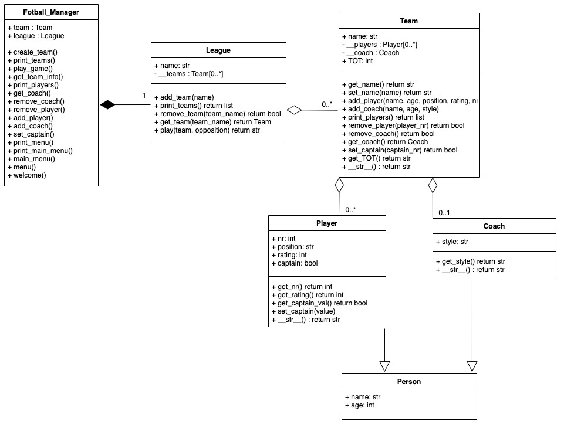

# BeTheCoach - UML-Diagram

# The Game
A Python project made with an intent to handle object-oriented programming.
This is performed by creating new classes when you take on the role of a coach.

# Instructions
1. Run the "fotball_manager.py" in a texteditor of your choice.
2. Follow the instructions that follows in the terminal.
3. Play around and make an impression on the team that you choose to manage.
